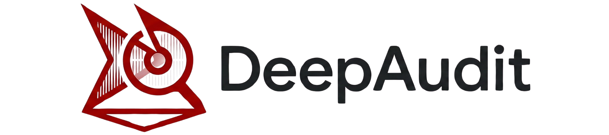
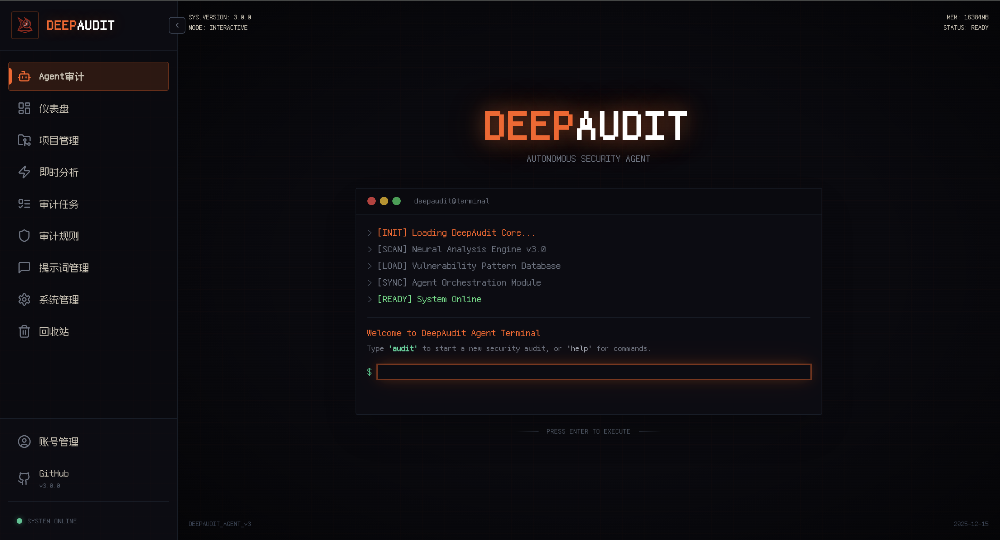
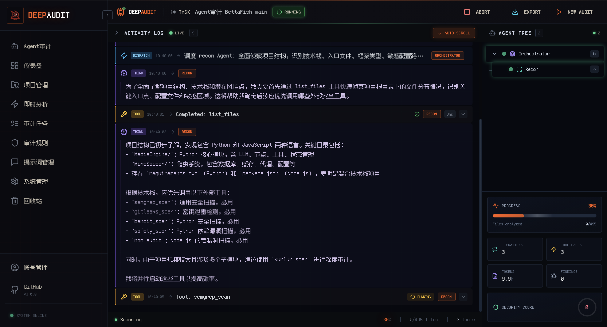
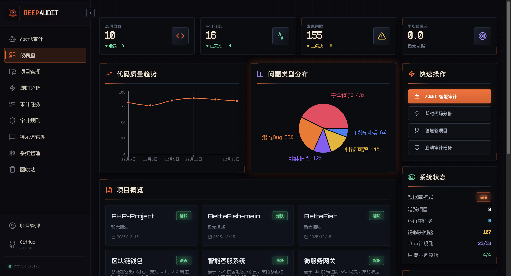
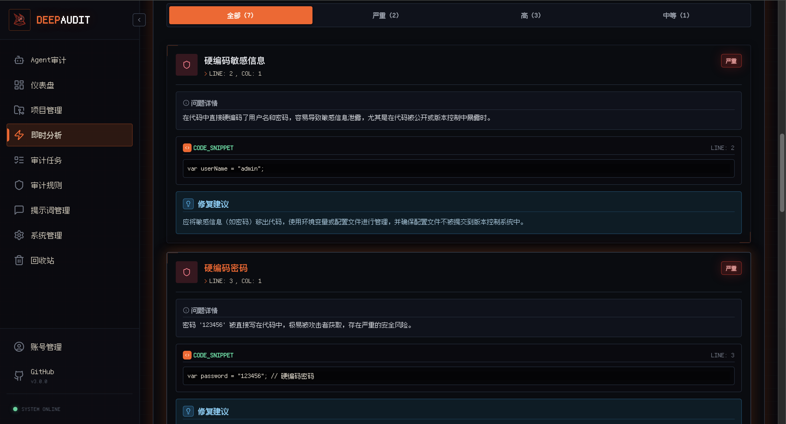
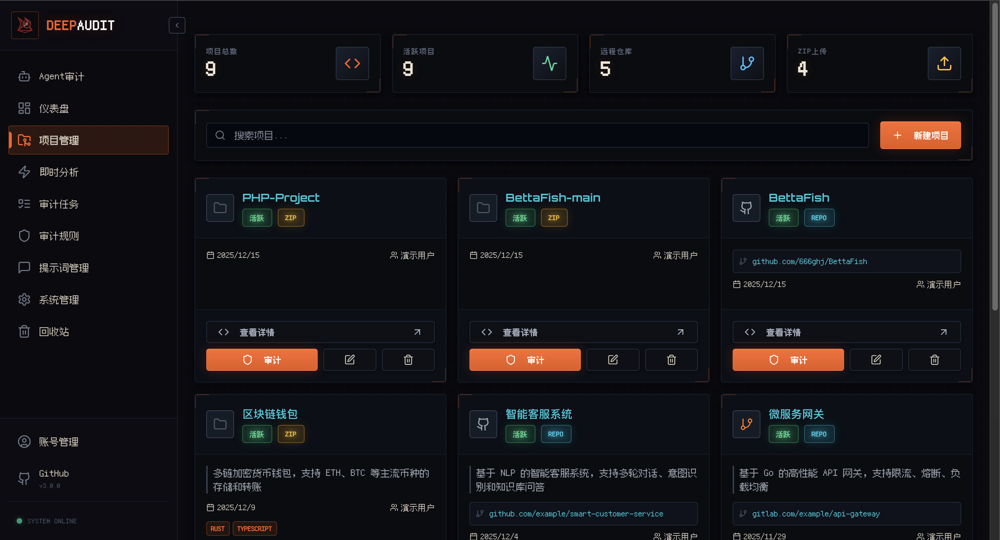
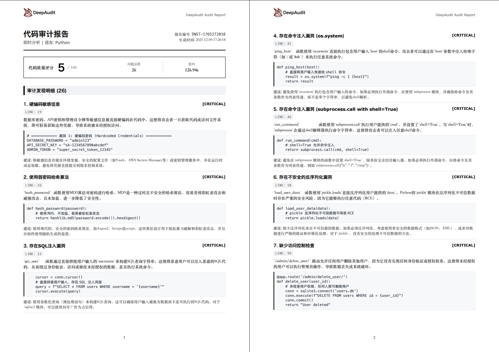
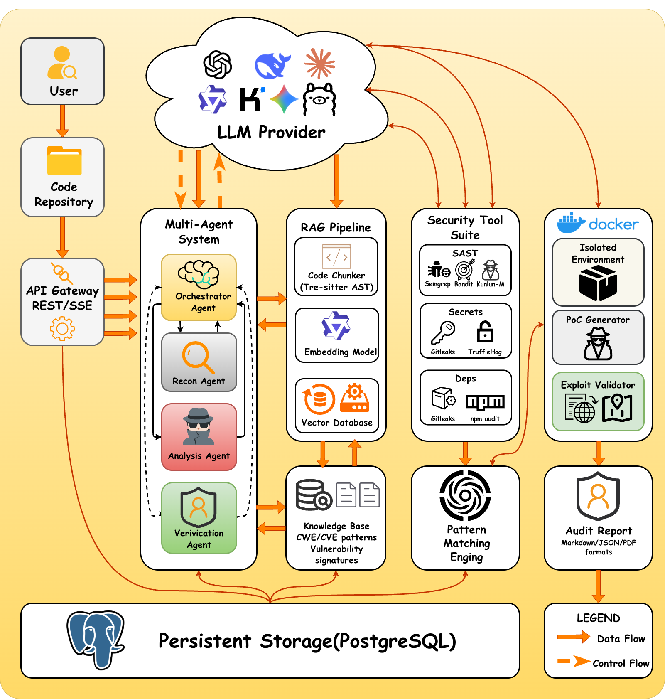

# DeepAudit - Your AI Security Audit Team, Making Vulnerability Discovery Accessible

<div style="width: 100%; max-width: 600px; margin: 0 auto;">
  
</div>

<div align="center">

[](https://github.com/lintsinghua/DeepAudit/releases)
[](https://www.gnu.org/licenses/agpl-3.0)
[](https://reactjs.org/)
[](https://www.typescriptlang.org/)
[](https://fastapi.tiangolo.com/)
[](https://www.python.org/)
[](https://deepwiki.com/lintsinghua/DeepAudit)

[](https://github.com/lintsinghua/DeepAudit/stargazers)
[](https://github.com/lintsinghua/DeepAudit/network/members)

<a href="https://trendshift.io/repositories/15634" target="_blank"></a>

<p align="center">
  <a href="README.md">简体中文</a> | <strong>English</strong>
</p>

</div>

<div align="center">
  
</div>

---

## Screenshots

<div align="center">

### Agent Audit Entry



*Quick access to Multi-Agent deep audit from the homepage*

</div>

<table>
<tr>
<td width="50%" align="center">
<strong>Audit Flow Logs</strong><br/><br/>
<br/>
<em>Real-time visibility into agent reasoning and execution</em>
</td>
<td width="50%" align="center">
<strong>Smart Dashboard</strong><br/><br/>
<br/>
<em>Understand the overall security posture of a project at a glance</em>
</td>
</tr>
<tr>
<td width="50%" align="center">
<strong>Instant Analysis</strong><br/><br/>
<br/>
<em>Paste code or upload files and get results in seconds</em>
</td>
<td width="50%" align="center">
<strong>Project Management</strong><br/><br/>
<br/>
<em>Import from GitHub/GitLab/Gitea and manage multiple projects together</em>
</td>
</tr>
</table>

<div align="center">

### Professional Reports



*One-click export to PDF / Markdown / JSON* (the screenshot shows quick mode, not an Agent-mode report)

[View the full Agent audit report example](https://lintsinghua.github.io/)

</div>

---

## CVE Vulnerability Discoveries

<div align="center">

### **DeepAudit has successfully discovered and obtained 49 CVE IDs and 6 GHSA security advisories**
### **Across 17 well-known open-source projects**

</div>

#### OpenClaw vulnerability research results

The internal preview version of DeepAudit performed a deep security audit on the [OpenClaw](https://github.com/openclaw/openclaw) project and has so far discovered **6 security vulnerabilities**, all of which were officially confirmed and published as security advisories (GHSA). The issues cover command injection, signature verification bypass, remote code execution, credential exposure, resource exhaustion, and information disclosure, including multiple high-severity findings. More vulnerabilities are still being researched.

| GHSA ID | Project | Popularity | Vulnerability Type | Severity |
|:---|:---|:---:|:---|:----:|
| [GHSA-g353-mgv3-8pcj](https://github.com/advisories/GHSA-g353-mgv3-8pcj) | OpenClaw | [](https://github.com/openclaw/openclaw/stargazers) | Signature Verification Bypass | 8.6 |
| [GHSA-99qw-6mr3-36qr](https://github.com/advisories/GHSA-99qw-6mr3-36qr) | OpenClaw | [](https://github.com/openclaw/openclaw/stargazers) | Code Execution | 8.5 |
| [GHSA-7h7g-x2px-94hj](https://github.com/advisories/GHSA-7h7g-x2px-94hj) | OpenClaw | [](https://github.com/openclaw/openclaw/stargazers) | Credential Exposure | 6.9 |
| [GHSA-g2f6-pwvx-r275](https://github.com/openclaw/openclaw/security/advisories/GHSA-g2f6-pwvx-r275) | OpenClaw | [](https://github.com/openclaw/openclaw/stargazers) | Command Injection | Medium |
| [GHSA-jq3f-vjww-8rq7](https://github.com/openclaw/openclaw/security/advisories/GHSA-jq3f-vjww-8rq7) | OpenClaw | [](https://github.com/openclaw/openclaw/stargazers) | Resource Exhaustion | High |
| [GHSA-xwcj-hwhf-h378](https://github.com/openclaw/openclaw/security/advisories/GHSA-xwcj-hwhf-h378) | OpenClaw | [](https://github.com/openclaw/openclaw/stargazers) | Information Disclosure | Medium |

| CVE ID | Project | Popularity | Vulnerability Type | CVSS |
|:---|:---|:---:|:---|:----:|
| [CVE-2026-1884](https://nvd.nist.gov/vuln/detail/CVE-2026-1884) | Zentao PMS | [](https://github.com/easysoft/zentaopms/stargazers) | SSRF | 5.1 |
| [CVE-2025-13789](https://nvd.nist.gov/vuln/detail/CVE-2025-13789) | Zentao PMS | [](https://github.com/easysoft/zentaopms/stargazers) | SSRF | 5.3 |
| [CVE-2025-13787](https://nvd.nist.gov/vuln/detail/CVE-2025-13787) | Zentao PMS | [](https://github.com/easysoft/zentaopms/stargazers) | Privilege Escalation | 9.1 |
| [CVE-2025-64428](https://nvd.nist.gov/vuln/detail/CVE-2025-64428) | Dataease | [](https://github.com/dataease/dataease/stargazers) | JNDI Injection | 9.8 |
| [CVE-2025-13246](https://nvd.nist.gov/vuln/detail/CVE-2025-13246) | Modulithshop | [](https://github.com/shsuishang/modulithshop/stargazers) | SQL Injection | 6.3 |
| [CVE-2025-64163](https://nvd.nist.gov/vuln/detail/CVE-2025-64163) | Dataease | [](https://github.com/dataease/dataease/stargazers) | SSRF | 9.8 |
| [CVE-2025-64164](https://nvd.nist.gov/vuln/detail/CVE-2025-64164) | Dataease | [](https://github.com/dataease/dataease/stargazers) | JNDI Injection | 9.8 |
| [CVE-2025-11581](https://nvd.nist.gov/vuln/detail/CVE-2025-11581) | PowerJob | [](https://github.com/PowerJob/PowerJob/stargazers) | Privilege Escalation | 7.5 |
| [CVE-2025-11580](https://nvd.nist.gov/vuln/detail/CVE-2025-11580) | PowerJob | [](https://github.com/PowerJob/PowerJob/stargazers) | Privilege Escalation | 5.3 |
| [CVE-2025-10771](https://nvd.nist.gov/vuln/detail/CVE-2025-10771) | Jimureport | [](https://github.com/jeecgboot/JimuReport/stargazers) | Deserialization | 9.8 |
| [CVE-2025-10770](https://nvd.nist.gov/vuln/detail/CVE-2025-10770) | Jimureport | [](https://github.com/jeecgboot/JimuReport/stargazers) | Deserialization | 6.5 |
| [CVE-2025-10769](https://nvd.nist.gov/vuln/detail/CVE-2025-10769) | H2o-3 | [](https://github.com/h2oai/h2o-3/stargazers) | Deserialization | 9.8 |
| [CVE-2025-10768](https://nvd.nist.gov/vuln/detail/CVE-2025-10768) | H2o-3 | [](https://github.com/h2oai/h2o-3/stargazers) | Deserialization | 9.8 |
| [CVE-2025-58045](https://nvd.nist.gov/vuln/detail/CVE-2025-58045) | Dataease | [](https://github.com/dataease/dataease/stargazers) | JNDI Injection | 9.8 |
| [CVE-2025-10423](https://nvd.nist.gov/vuln/detail/CVE-2025-10423) | Newbee-mall | [](https://github.com/newbee-ltd/newbee-mall/stargazers) | Guessable Captcha | 3.7 |
| [CVE-2025-10422](https://nvd.nist.gov/vuln/detail/CVE-2025-10422) | Newbee-mall | [](https://github.com/newbee-ltd/newbee-mall/stargazers) | Privilege Escalation | 4.3 |
| [CVE-2025-9835](https://nvd.nist.gov/vuln/detail/CVE-2025-9835) | Mall | [](https://github.com/macrozheng/mall/stargazers) | Privilege Escalation | 4.3 |
| [CVE-2025-9737](https://nvd.nist.gov/vuln/detail/CVE-2025-9737) | O2oa | [](https://github.com/o2oa/o2oa/stargazers) | XSS | 5.4 |
| [CVE-2025-9736](https://nvd.nist.gov/vuln/detail/CVE-2025-9736) | O2oa | [](https://github.com/o2oa/o2oa/stargazers) | XSS | 5.4 |
| [CVE-2025-9735](https://nvd.nist.gov/vuln/detail/CVE-2025-9735) | O2oa | [](https://github.com/o2oa/o2oa/stargazers) | XSS | 5.4 |
| [CVE-2025-9734](https://nvd.nist.gov/vuln/detail/CVE-2025-9734) | O2oa | [](https://github.com/o2oa/o2oa/stargazers) | XSS | 5.4 |
| [CVE-2025-9719](https://nvd.nist.gov/vuln/detail/CVE-2025-9719) | O2oa | [](https://github.com/o2oa/o2oa/stargazers) | XSS | 5.4 |
| [CVE-2025-9718](https://nvd.nist.gov/vuln/detail/CVE-2025-9718) | O2oa | [](https://github.com/o2oa/o2oa/stargazers) | XSS | 5.4 |
| [CVE-2025-9717](https://nvd.nist.gov/vuln/detail/CVE-2025-9717) | O2oa | [](https://github.com/o2oa/o2oa/stargazers) | XSS | 5.4 |
| [CVE-2025-9716](https://nvd.nist.gov/vuln/detail/CVE-2025-9716) | O2oa | [](https://github.com/o2oa/o2oa/stargazers) | XSS | 5.4 |
| [CVE-2025-9715](https://nvd.nist.gov/vuln/detail/CVE-2025-9715) | O2oa | [](https://github.com/o2oa/o2oa/stargazers) | XSS | 5.4 |
| [CVE-2025-9683](https://nvd.nist.gov/vuln/detail/CVE-2025-9683) | O2oa | [](https://github.com/o2oa/o2oa/stargazers) | XSS | 5.4 |
| [CVE-2025-9682](https://nvd.nist.gov/vuln/detail/CVE-2025-9682) | O2oa | [](https://github.com/o2oa/o2oa/stargazers) | XSS | 5.4 |
| [CVE-2025-9681](https://nvd.nist.gov/vuln/detail/CVE-2025-9681) | O2oa | [](https://github.com/o2oa/o2oa/stargazers) | XSS | 5.4 |
| [CVE-2025-9680](https://nvd.nist.gov/vuln/detail/CVE-2025-9680) | O2oa | [](https://github.com/o2oa/o2oa/stargazers) | XSS | 5.4 |
| [CVE-2025-9659](https://nvd.nist.gov/vuln/detail/CVE-2025-9659) | O2oa | [](https://github.com/o2oa/o2oa/stargazers) | XSS | 5.4 |
| [CVE-2025-9658](https://nvd.nist.gov/vuln/detail/CVE-2025-9658) | O2oa | [](https://github.com/o2oa/o2oa/stargazers) | XSS | 5.4 |
| [CVE-2025-9657](https://nvd.nist.gov/vuln/detail/CVE-2025-9657) | O2oa | [](https://github.com/o2oa/o2oa/stargazers) | XSS | 5.4 |
| [CVE-2025-9655](https://nvd.nist.gov/vuln/detail/CVE-2025-9655) | O2oa | [](https://github.com/o2oa/o2oa/stargazers) | XSS | 5.4 |
| [CVE-2025-9646](https://nvd.nist.gov/vuln/detail/CVE-2025-9646) | O2oa | [](https://github.com/o2oa/o2oa/stargazers) | XSS | 5.4 |
| [CVE-2025-9602](https://nvd.nist.gov/vuln/detail/CVE-2025-9602) | RockOA | [](https://github.com/rainrocka/xinhu/stargazers) | Database Backdoor | 6.5 |
| [CVE-2025-9514](https://nvd.nist.gov/vuln/detail/CVE-2025-9514) | Mall | [](https://github.com/macrozheng/mall/stargazers) | Privilege Escalation | 3.7 |
| [CVE-2025-9264](https://nvd.nist.gov/vuln/detail/CVE-2025-9264) | Xxl-job | [](https://github.com/xuxueli/xxl-job/stargazers) | Privilege Escalation | 5.4 |
| [CVE-2025-9263](https://nvd.nist.gov/vuln/detail/CVE-2025-9263) | Xxl-job | [](https://github.com/xuxueli/xxl-job/stargazers) | Privilege Escalation | 4.3 |
| [CVE-2025-9241](https://nvd.nist.gov/vuln/detail/CVE-2025-9241) | Eladmin | [](https://github.com/elunez/eladmin/stargazers) | CSV/XLSX Injection | 7.5 |
| [CVE-2025-9240](https://nvd.nist.gov/vuln/detail/CVE-2025-9240) | Eladmin | [](https://github.com/elunez/eladmin/stargazers) | Sensitive Information Disclosure | 4.3 |
| [CVE-2025-9239](https://nvd.nist.gov/vuln/detail/CVE-2025-9239) | Eladmin | [](https://github.com/elunez/eladmin/stargazers) | Hardcoded Credentials | 3.7 |
| [CVE-2025-8974](https://nvd.nist.gov/vuln/detail/CVE-2025-8974) | Litemall | [](https://github.com/linlinjava/litemall/stargazers) | Hardcoded Credentials | 9.8 |
| [CVE-2025-8852](https://nvd.nist.gov/vuln/detail/CVE-2025-8852) | Wukong CRM | [](https://github.com/WuKongOpenSource/WukongCRM-11.0-JAVA/stargazers) | Sensitive Information Disclosure | 4.3 |
| [CVE-2025-8840](https://nvd.nist.gov/vuln/detail/CVE-2025-8840) | JshERP | [](https://github.com/jishenghua/jshERP/stargazers) | Privilege Escalation | 5.4 |
| [CVE-2025-8839](https://nvd.nist.gov/vuln/detail/CVE-2025-8839) | JshERP | [](https://github.com/jishenghua/jshERP/stargazers) | Privilege Escalation | 8.8 |
| [CVE-2025-8764](https://nvd.nist.gov/vuln/detail/CVE-2025-8764) | Litemall | [](https://github.com/linlinjava/litemall/stargazers) | XSS | 5.4 |
| [CVE-2025-8753](https://nvd.nist.gov/vuln/detail/CVE-2025-8753) | Litemall | [](https://github.com/linlinjava/litemall/stargazers) | Arbitrary File Deletion | 5.4 |
| [CVE-2025-8708](https://nvd.nist.gov/vuln/detail/CVE-2025-8708) | White-Jotter | [](https://github.com/Antabot/White-Jotter/stargazers) | Deserialization | 7.5 |

[View the full CVE list](CVEList.md)

> The vulnerabilities above were discovered with DeepAudit by DeepAudit team members [@lintsinghua](https://github.com/lintsinghua) and [@ez-lbz](https://github.com/ez-lbz).

> If you discover vulnerabilities using DeepAudit, you are welcome to leave feedback in [Issues](https://github.com/lintsinghua/DeepAudit/issues/135). Your contributions will greatly enrich this vulnerability list.

---

## Overview

**DeepAudit** is a next-generation code security auditing platform built on a **Multi-Agent collaborative architecture**. It is not just a static scanner. Instead, it simulates the reasoning model of security experts through autonomous collaboration among multiple intelligent agents (**Orchestrator**, **Recon**, **Analysis**, **Verification**) to achieve deep code understanding, vulnerability discovery, and **automated sandboxed PoC verification**.

We are committed to solving three major pain points of traditional SAST tools:
- **High false-positive rates**: lack of semantic understanding leads to large amounts of noisy findings and wasted review effort
- **Business-logic blind spots**: inability to understand cross-file calls and complex logic flows
- **Lack of verification**: no way to determine whether a vulnerability is actually exploitable

Users only need to import a project, and DeepAudit automatically starts the workflow: identify the technology stack, analyze potential risks, generate exploit scripts, verify them in a sandbox, and then produce a professional audit report.

> **Core philosophy**: Let AI attack like a hacker and defend like an expert.

## V6.0 Highlights

- **Faster quick scans**: quick scan now defaults to a pure local rule engine instead of implicitly invoking LLM review; file discovery prunes excluded directories early and rule matching uses precompiled patterns with parallel file processing.
- **Scheduled scans**: quick-scan and Agent audit creation support recurring scan intervals and allowed scan windows in Advanced Options. The current scan starts immediately, while future scans are saved with the selected scan mode.
- **Brand update**: the Agent audit splash screen now displays `TopSec Audit`.
- **Admin improvements**: full name is optional when creating users; the system knowledge base is seeded with built-in general vulnerability knowledge.
- **Dialog fix**: file selection in Advanced Options stays centered and no longer jitters in the lower-right corner.

## Why Choose DeepAudit?

<div align="center">

| Traditional Audit Pain Points | DeepAudit Solutions |
| :--- | :--- |
| **Low manual audit efficiency**<br>Cannot keep up with CI/CD iteration speed and slows down releases | **Multi-Agent autonomous auditing**<br>AI automatically orchestrates auditing strategies and runs them around the clock |
| **Too many false positives**<br>Lack of semantic understanding means a lot of time is wasted cleaning noisy findings | **RAG knowledge enhancement**<br>Combines code semantics with project context to significantly reduce false positives |
| **Data privacy concerns**<br>Worried about core source code leaking to cloud AI services and failing compliance requirements | **Ollama local deployment support**<br>Data stays inside your environment and supports local models such as Llama3 and DeepSeek |
| **Cannot confirm real exploitability**<br>Too many findings in outsourced projects and no clear way to know which are real | **Sandboxed PoC verification**<br>Automatically generates and runs attack scripts to confirm real impact |

</div>

---

## System Architecture

### Architecture Diagram

DeepAudit uses a microservice architecture driven by a Multi-Agent engine at its core.

<div align="center">

</div>

### Audit Workflow

| Step | Phase | Responsible Agent | Main Actions |
|:---:|:---:|:---:|:---|
| 1 | **Strategy Planning** | **Orchestrator** | Receives the audit task, analyzes the project type, creates an audit plan, and dispatches tasks to sub-agents |
| 2 | **Information Gathering** | **Recon Agent** | Scans the project structure, identifies frameworks, libraries, and APIs, and extracts entry points |
| 3 | **Vulnerability Discovery** | **Analysis Agent** | Combines RAG knowledge and AST analysis to deeply inspect the code and find potential vulnerabilities |
| 4 | **PoC Verification** | **Verification Agent** | **(Critical)** Writes PoC scripts and executes them in a Docker sandbox, with self-correction and retries on failure |
| 5 | **Report Generation** | **Orchestrator** | Aggregates all findings, removes false positives disproven by verification, and generates the final report |

### Project Structure

```text
DeepAudit/
├── backend/                        # Python FastAPI backend
│   ├── app/
│   │   ├── agents/                 # Multi-Agent core logic
│   │   │   ├── orchestrator.py     # Command center: task orchestration
│   │   │   ├── recon.py            # Reconnaissance: asset identification
│   │   │   ├── analysis.py         # Analyst: vulnerability discovery
│   │   │   └── verification.py     # Verifier: sandbox PoC
│   │   ├── core/                   # Core configuration and sandbox interfaces
│   │   ├── models/                 # Database models
│   │   └── services/               # RAG and LLM service wrappers
│   └── tests/                      # Unit tests
├── frontend/                       # React + TypeScript frontend
│   └── src/
│       ├── components/             # UI component library
│       ├── pages/                  # Page routes
│       └── stores/                 # Zustand state management
├── docker/                         # Docker deployment configuration
│   ├── sandbox/                    # Secure sandbox image build
│   └── postgres/                   # Database initialization
└── docs/                           # Detailed documentation
```

---

## Quick Start

### Option 1: One-Line Deployment (Recommended)

Use the prebuilt Docker images. You do not need to clone the repository:

```bash
curl -fsSL https://raw.githubusercontent.com/lintsinghua/DeepAudit/v3.0.0/docker-compose.prod.yml | docker compose -f - up -d
```

## China-Accelerated Deployment

Use the Nanjing University mirror site to accelerate pulling Docker images by replacing `ghcr.io` with `ghcr.nju.edu.cn`:

```bash
# China-accelerated version using the Nanjing University GHCR mirror
curl -fsSL https://raw.githubusercontent.com/lintsinghua/DeepAudit/v3.0.0/docker-compose.prod.cn.yml | docker compose -f - up -d
```

<details>
<summary>Manually pull images if needed (click to expand)</summary>

```bash
# Frontend image
docker pull ghcr.nju.edu.cn/lintsinghua/deepaudit-frontend:latest

# Backend image
docker pull ghcr.nju.edu.cn/lintsinghua/deepaudit-backend:latest

# Sandbox image
docker pull ghcr.nju.edu.cn/lintsinghua/deepaudit-sandbox:latest
```

</details>

> Mirror support is provided by the [Nanjing University Open Source Mirror Station](https://mirrors.nju.edu.cn/).

<details>
<summary>Configure Docker registry mirrors (optional, for even faster image pulling) (click to expand)</summary>

If image pulling is still slow, you can configure Docker registry mirrors by editing the Docker daemon configuration.

**Linux / macOS**: edit `/etc/docker/daemon.json`

**Windows**: right-click the Docker Desktop tray icon -> `Settings` -> `Docker Engine`

```json
{
  "registry-mirrors": [
    "https://docker.1ms.run",
    "https://dockerproxy.com",
    "https://hub.rat.dev"
  ]
}
```

Restart Docker after saving:

```bash
# Linux
sudo systemctl restart docker

# macOS / Windows
# Restart Docker Desktop
```

</details>

> **Started successfully?** On a LAN deployment, open `https://<server-lan-ip>:3000` to begin.

> The frontend container automatically generates a self-signed HTTPS certificate. Browser warnings about the certificate not being trusted are expected for this LAN setup; choose to continue to the site.

---

### Option 2: Clone and Deploy

Suitable if you need custom configuration or want to develop on top of the project:

```bash
# 1. Clone the project
git clone https://github.com/lintsinghua/DeepAudit.git && cd DeepAudit

# 2. Configure environment variables
cp backend/env.example backend/.env
# Edit backend/.env and fill in your LLM API key

# 3. Start everything
docker compose up -d
```

> The first startup will automatically build the sandbox image and may take a few minutes.

---

## Source Development Guide

Suitable for developers doing secondary development and debugging.

### Requirements
- Python 3.11+
- Node.js 20+
- PostgreSQL 15+
- Docker (for the sandbox)

### 1. Start the database manually

```bash
docker compose up -d redis db adminer
```

### 2. Start the backend

```bash
cd backend
# Configure environment variables
cp env.example .env

# Use uv to manage the environment (recommended)
uv sync
source .venv/bin/activate

# Start the API service
uvicorn app.main:app --reload
```

### 3. Start the frontend

```bash
cd frontend
# Configure environment variables
cp .env.example .env

pnpm install
pnpm dev
```

### 4. Sandbox environment

In development mode, you need to pull the sandbox image locally:

```bash
# Standard pull
docker pull ghcr.io/lintsinghua/deepaudit-sandbox:latest

# China-accelerated pull (Nanjing University mirror)
docker pull ghcr.nju.edu.cn/lintsinghua/deepaudit-sandbox:latest
```

---

## Multi-Agent Intelligent Audit

### Supported Vulnerability Types

<table>
<tr>
<td>

| Vulnerability Type | Description |
|---------|------|
| `sql_injection` | SQL injection |
| `xss` | Cross-site scripting |
| `command_injection` | Command injection |
| `path_traversal` | Path traversal |
| `ssrf` | Server-side request forgery |
| `xxe` | XML external entity injection |

</td>
<td>

| Vulnerability Type | Description |
|---------|------|
| `insecure_deserialization` | Insecure deserialization |
| `hardcoded_secret` | Hardcoded secrets |
| `weak_crypto` | Weak cryptography |
| `authentication_bypass` | Authentication bypass |
| `authorization_bypass` | Authorization bypass |
| `idor` | Insecure direct object reference |

</td>
</tr>
</table>

> For detailed documentation, see **[Agent Audit Guide](docs/AGENT_AUDIT.md)**.

---

## Supported LLM Platforms

<table>
<tr>
<td align="center" width="33%">
<h3>International Platforms</h3>
<p>
OpenAI GPT-4o / GPT-4<br/>
Claude 3.5 Sonnet / Opus<br/>
Google Gemini Pro<br/>
DeepSeek V3
</p>
</td>
<td align="center" width="33%">
<h3>China Platforms</h3>
<p>
Tongyi Qwen<br/>
Zhipu GLM-4<br/>
Moonshot Kimi<br/>
Wenxin Yiyan / MiniMax / Doubao
</p>
</td>
<td align="center" width="33%">
<h3>Local Deployment</h3>
<p>
<strong>Ollama</strong><br/>
Llama3 / Qwen2.5 / CodeLlama<br/>
DeepSeek-Coder / Codestral<br/>
<em>Your code stays on-premises</em>
</p>
</td>
</tr>
</table>

Supports API relay/proxy endpoints to address network access issues. See [LLM Platform Support](docs/LLM_PROVIDERS.md) for details.

---

## Feature Matrix

| Feature | Description | Mode |
|------|------|------|
| **Agent deep audit** | Multi-Agent collaboration with autonomous audit strategy orchestration | Agent |
| **RAG knowledge enhancement** | Code semantic understanding with CWE/CVE knowledge-base retrieval | Agent |
| **Sandbox PoC verification** | Docker-isolated execution to verify exploitability | Agent |
| **Pure-rule quick scan** | Local rule-engine scan, no default LLM calls, suitable for fast batch detection | General |
| **Scheduled scan** | Recurring scan interval and allowed scan window for automatic follow-up tasks | General |
| **Project management** | GitHub/GitLab/Gitea import, ZIP upload, 10+ language support | General |
| **Instant analysis** | Analyze code snippets in seconds by pasting them directly | General |
| **Five-dimensional inspection** | Bug / Security / Performance / Style / Maintainability | General |
| **What-Why-How** | Precise issue location, root-cause explanation, and remediation suggestions | General |
| **Audit rules** | Built-in OWASP Top 10 with support for custom rule sets | General |
| **Vulnerability knowledge base** | Seeds public general vulnerability knowledge and supports admin maintenance | General |
| **Prompt templates** | Visual management with bilingual support | General |
| **Report export** | One-click export to PDF / Markdown / JSON | General |
| **Runtime configuration** | Configure LLM settings in the browser without restarting services | General |

## Roadmap

We are continuing to evolve the platform with support for more languages and stronger agent capabilities.

- [x] Basic static analysis with Semgrep integration
- [x] RAG knowledge base and Docker security sandbox support
- [x] **Multi-Agent collaborative architecture** (current)
- [ ] Support more realistic simulated service environments for more realistic vulnerability verification workflows
- [ ] Upgrade the sandbox integration from `function_call` to a stable MCP service
- [ ] **Auto-Fix**: allow agents to directly submit PRs to fix vulnerabilities
- [ ] **Incremental PR audit**: continuously track PR changes, intelligently analyze vulnerabilities, and integrate with CI/CD pipelines
- [ ] **Optimize RAG**: support custom knowledge bases

---

## Contributing & Community

### Contributing Guide

We warmly welcome contributions of all kinds, whether that means filing issues, opening PRs, or improving documentation.
Please refer to [CONTRIBUTING.md](./CONTRIBUTING.md) for details.

### Contact the Author

<div align="center">

**You are welcome to reach out for technical discussions, feature suggestions, or collaboration opportunities.**
For platform customization, code auditing services, technical consulting, or business collaboration, please contact by email.

| Contact | |
|:---:|:---:|
| **Email** | **lintsinghua@qq.com** |
| **GitHub** | [@lintsinghua](https://github.com/lintsinghua) |

</div>

## License

This project is open-source under the [AGPL-3.0 License](LICENSE).

## Project Popularity

<a href="https://star-history.com/#lintsinghua/DeepAudit&Date">
 <picture>
   <source media="(prefers-color-scheme: dark)" srcset="https://api.star-history.com/svg?repos=lintsinghua/DeepAudit&type=Date&theme=dark" />
   <source media="(prefers-color-scheme: light)" srcset="https://api.star-history.com/svg?repos=lintsinghua/DeepAudit&type=Date" />
   
 </picture>
</a>

---

<div align="center">
  <strong>Made with ❤️ by <a href="https://github.com/lintsinghua">lintsinghua</a></strong>
</div>

---

## Acknowledgements

Thanks to the following open-source projects for their support:

[FastAPI](https://fastapi.tiangolo.com/) / [LangChain](https://langchain.com/) / [LangGraph](https://langchain-ai.github.io/langgraph/) / [ChromaDB](https://www.trychroma.com/) / [LiteLLM](https://litellm.ai/) / [Tree-sitter](https://tree-sitter.github.io/) / [Kunlun-M](https://github.com/LoRexxar/Kunlun-M) / [Strix](https://github.com/usestrix/strix) / [React](https://react.dev/) / [Vite](https://vitejs.dev/) / [Radix UI](https://www.radix-ui.com/) / [TailwindCSS](https://tailwindcss.com/) / [shadcn/ui](https://ui.shadcn.com/)

---

## Important Security Notice

### Legal Compliance Statement

1. **Any unauthorized vulnerability testing, penetration testing, or security assessment is strictly prohibited**
2. This project is intended only for cybersecurity research, teaching, and learning
3. It is strictly prohibited to use this project for illegal purposes or for unauthorized security testing

### Vulnerability Reporting Responsibility

1. If you discover any security vulnerability, please report it through legitimate channels in a timely manner
2. It is strictly prohibited to use discovered vulnerabilities for illegal activities
3. Comply with cybersecurity laws and regulations and help maintain a secure cyberspace

### Usage Restrictions

- Only use this project in authorized environments for education and research
- Do not use it for security testing against unauthorized systems
- Users are solely responsible for their own actions

### Disclaimer

The author is not responsible for any direct or indirect losses caused by the use of this project. Users bear full legal responsibility for their own actions.

---

## Detailed Security Policy

For detailed information about installation policies, disclaimers, code privacy, API usage security, and vulnerability reporting, please refer to [DISCLAIMER.md](DISCLAIMER.md) and [SECURITY.md](SECURITY.md).

### Quick Reference

- **Code privacy warning**: your code will be sent to the servers of the selected LLM provider
- **Sensitive code handling**: use local models when processing sensitive code
- **Compliance requirements**: follow data protection and privacy laws
- **Vulnerability reporting**: report security issues through legitimate channels
